Pedagogue Pages is a desktop app for **teachers of young children** to **manage class rosters and keep track of 
their students' contact details**. It is a **Command Line Interface (CLI)** based application, whereby you can type 
in various commands into an input box to perform certain actions. It also comes with a **Graphical User 
Interface (GUI)** to display information to you.

We believe that Pedagogue Pages will represent a huge upgrade for you when managing your 
students' contacts. Want to experience just how big of a difference it can make? Follow the steps **within this user 
guide** and find out!

* Table of Contents
{:toc}

--------------------------------------------------------------------------------------------------------------------
# Introduction to Pedagogue Pages

Pedagogue Pages is an address book application for class rostering and student contact management that hold many 
advantages over traditional rostering methods such as Excel and physical methods. In terms of its basic functionalities as an address book, it performs just like any other similar application, allowing
for the creation, updating, reading and deletion (CRUD) of contacts.

However, we consider Pedagogue Pages to be **safer and more convenient than Excel** when it comes to these functions,
since it checks for empty fields when creating and updating new contacts, has no ambiguity within the commands given (One command, one action) and allows
for the adding and updating of multiple fields of a single contact at once.

Furthermore, Pedagogue Pages is **highly specialised** for the target audience, customized from the get-go for
**you** with the addition of fields such as `student ID` and `form class` for each contact. The
implementation of tagging and tag-related features such as **finding by tag** also allows for **unparalleled
flexibility** for student contact management not provided by Excel. Finally, even though we emphasise the benefits of 
using Pedagogue Pages over Excel, we provide full backwards compatibility with Excel with our import, export and migrate
features, which will allow you to seamlessly transition lists between Excel and Pedagogue Pages.

# Navigating this user guide
This user guide is friendly for everyone, be it individuals that are used to Pedagogue Pages or applications,
or individuals completely new to them. Don't worry, this user guide familiarises you with the application step by step and provides 
detailed examples on how you can use it.

To get started, refer to the [Quick start](#quick-start) section for a quick and easy guide on setting up Pedagogue 
Pages on your computer.

## For new users:
1. Refer to the [Glossary and Notations](#glossary-and-notations) section for a guide on commonly used terms, 
   abbreviations and notations in this user guide.
2. Refer to the [Navigating the GUI](#navigating-the-gui) section to familiarise yourself with the visuals of the 
   application.
3. **Features**: Once you feel confident, you can then check out the [Features](#features) section to explore the 
   various features offered by Pedagogue Pages.

## For advanced users:
1. If you feel comfortable with CLI based applications, feel free to directly proceed to the [Features](#features) 
   section to explore the various features offered by Pedagogue Pages.
2. If you are currently experiencing issues with your copy of Pedagogue Pages, you can refer to the [FAQ](#faq) or 
   [Troubleshooting](#troubleshooting-and-known-issues) sections in this user guide.
3. For those who wish to find out more about how Pedagogue Pages works behind the scenes, feel free to explore our 
   Developer Guide [here](https://ay2324s2-cs2103t-w10-3.github.io/tp/DeveloperGuide.html).

--------------------------------------------------------------------------------------------------------------------
# Glossary and notations

The glossary table below provides definitions for some commonly used technical terms or abbreviations in this user 
guide:  

| Term                 | Definition                                                                                                                                                                                                                  |
|----------------------|-----------------------------------------------------------------------------------------------------------------------------------------------------------------------------------------------------------------------------|
| **GUI**              | GUI, or Graphical User Interface refers to the application window of Pedagogue Pages.                                                                                                                                       |
| **CLI**              | CLI, or Command Line Interface refers to a text-based user interface in which the user enters commands to use Pedagogue Pages.                                                                                              |
| **Command**          | A command refers to an action you can perform in the application. For a quick summary of the commands available to you in Pedagogue Pages, refer to the [Command Summary](#command-summary-and-field-restrictions) section. |
| **Prefix**           | In the context of the application, a Prefix refers to a slash `/` followed by either a letter or a word. It is used to denote a particular field or detail you will have to provide for a command.                          |
| **Case-sensitive**   | The case of letters in the input affects the result of the command. An input ``test`` produces a different result from the input `Test`.                                                                                    |
| **Case-insensitive** | The case of letters in the input do not affect the result of the command. An input ``test`` produces the same result as the input `Test`.                                                                                   |
| **JSON**             | JSON, or JavaScript Object Notation. The data in Pedagogue Pages is stored in JSON files, which can be identified by the suffix `.json`.                                                                                    |
| **CSV**              | CSV, or Comma Separated Values. CSV files can be generated by exporting lists of students from Pedagogue Pages, they can also be imported into Pedagogue Pages. These files can be identified with the suffix `.csv`.       |

The notation table below includes a set of icons that will be used in this user guide: 

| Symbol               | Definition                                                                    |
|----------------------|-------------------------------------------------------------------------------|
| :grey_exclamation:   | Important information.                                                        |
| :warning:            | Warning. A bug can occur or Pedagogue Pages may behave in an expected manner. |
| :x:                  | Do Not. Will result in a bug.                                                 |
| :pushpin             | Tips and tricks.                                                              |

# Quick start

1. Ensure you have Java `11` or above installed in your computer.

2. If you are unsure if Java `11` or above is installed in your device, you can download Java `11` from [here](https://www.oracle.com/sg/java/technologies/javase/jdk11-archive-downloads.html). Take 
   note of the operating system of your computer (Linux, Windows or macOS) to download the correct file.

3. After ensuring that you have Java `11` or above installed on your computer, download the latest `pedagoguepages.jar` from the release **v1.3** [here](https://github.com/AY2324S2-CS2103T-W10-3/tp/releases).

4. Copy the file to **an empty folder** you want to use as the **home folder** for Pedagogue Pages.

5. For users familiar with using the command terminal, open a command terminal, navigate using `cd` into the folder you 
   put `pedagoguepages.jar` in, and use the`java -jar pedagoguepages.jar` command to run the application.   If 
   you are uncomfortable with using the command terminal, **double-clicking** `pedagoguepages.jar` works too.

6. If all the steps above were performed correctly, an application window similar to the image below should appear in a 
   few seconds. For new users, the application window should contain some sample student contact entries. For users 
   that have previously used the application, it should be showing the list of student contacts you were viewing 
   before you exited Pedagogue Pages during the last session.
      
   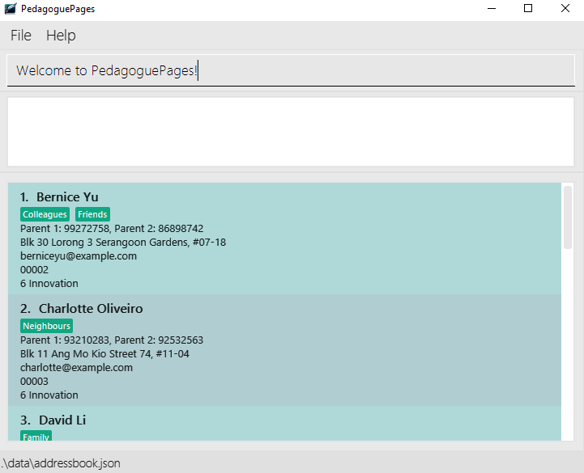    
7. To start with an empty student contact list, enter `clear` into the command box and press enter.
8. Refer to the [Navigating the GUI](#navigating-the-gui) section to learn how the GUI works.
9. Refer to the [Features](#features) below for details of each command.

--------------------------------------------------------------------------------------------------------------------

# Navigating the GUI

Below is an image of Pedagogue Pages' GUI and its component parts:    
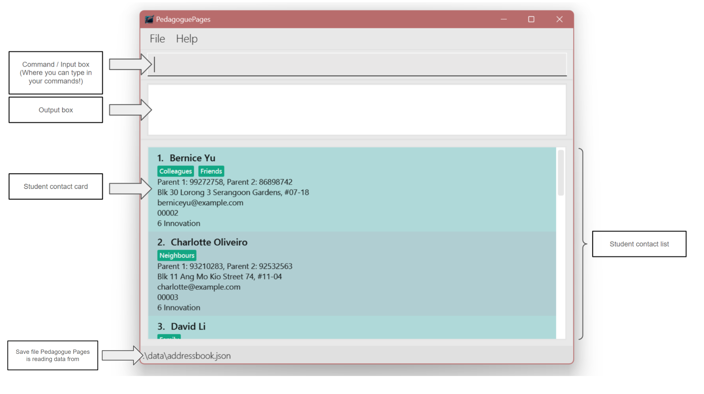
   
Each individual student contact card has the follow components:    
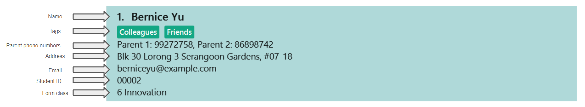
  

--------------------------------------------------------------------------------------------------------------------

# Command summary

The following table provides a summary of the commands available for your usage in Pedagogue Pages. To execute any 
command, press enter after entering the command into the command box:

| Command     | Purpose                                                                                                    |
|-------------|------------------------------------------------------------------------------------------------------------|
| `list`      | Displays the entire list in the save file Pedagogue Pages is reading from.                                 |
| `help`      | Brings up the help pop-up window, which provides a hyperlink to the user guide.                            |
| `add`       | Adds a new student contact to the student contact list.                                                    |
| `edit`      | Edits an existing student contact in the student contact list.                                             |
| `delete`    | Deletes an existing student contact in the student contact list permanently.                               |
| `clear`     | Deletes all existing student contacts in the student contact list permanently.                             |
| `deleteTag` | Deletes a specified tag from all student contacts in the student contact list.                             |
| `find`      | Finds student contacts that matches a name, student ID, form class or tag.                                 |
| `export`    | Exports the _**currently displayed**_ student contact list to a CSV file in the `exports` folder.          |
| `import`    | Imports a CSV file from the `imports` folder into Pedagogue Pages.                                         |
| `migrate`   | Merges the student contacts in a CSV file from the `imports` folder into the current student contact list. |
| `cd`        | Changes the save file in the `data` folder Pedagogue Pages is reading from.                                |
| `undo`      | Undoes the previous command if and only if the previous command was an `add`, `edit` or `delete` command.  |
| `theme`     | Changes the visual theme of the Pedagogue Pages GUI.                                                       |
| `exit`      | Closes the Pedagogue Pages application.                                                                    |

--------------------------------------------------------------------------------------------------------------------

# Features

## Preliminary notes

**:grey_exclamation: Notes about the command format:** 

* Words in `UPPER_CASE` are the parameters to be supplied by you. Parameters without `[ ]` around them are 
  compulsory fields that you must supply for the command to work.  
  e.g. in `add n/NAME`, `NAME` is a parameter which can be used as `add n/John Doe`.

* Parameters in square brackets are optional. 
  e.g `n/NAME [t/TAG]` can be used as `n/John Doe t/friend` or as `n/John Doe`.

* Parameters with `…`​ after them can be used multiple times including zero times. 
  e.g. `[t/TAG]…​` can be used as ` ` (i.e. 0 times), `t/friend`, `t/friend t/family` etc.

* Parameters can be in any order.  
  e.g. if the command specifies `n/NAME p/PHONE_NUMBER`, `p/PHONE_NUMBER n/NAME` is also an acceptable input.

* **Parameters have input restrictions that can be found in this [table](#input-restrictions).**

* Extraneous parameters for commands that do not take in parameters (such as `help`, `list`, `exit` and `clear`) will be ignored. 
  e.g. if the command specifies `help 123`, it will be interpreted as `help`.

* If you are using a PDF version of this document, be careful when copying and pasting commands that span multiple lines as space characters surrounding line-breaks may be omitted when copied over to the application.

## Basic features: Create, Read, Update, Delete

### Adding a student contact: `add`

**Purpose**: Adds a student contact to the student contact list in Pedagogue Pages. You can use it to add the details of new students.

**Format**: `add n/NAME p/PARENT_PHONE_NUMBER_1, [PARENT_PHONE_NUMBER_2] e/STUDENT_EMAIL a/ADDRESS id/STUDENT_ID 
class/CLASS_NAME [t/TAG]…​`

**Example**: `add n/John Doe p/93333333, 92222222 e/johndoe@mail.com a/123 Oxford Street id/00001 class/3A t/Band` 
 
This sample command adds to the student contact list a student with the **name** `John Doe`, **student ID** `00001` 
from **class** `3A`, whose parents have the **contact numbers** `93333333` and `92222222` respectively. The student 
also has an **email** `johndoe@mail.com`, has the **address** `a/123 Oxford Street` and is from the school `Band`.  

**Image of command**: The image below shows the sample command within the command box    

  
**Image of result**: The image below shows what the GUI of Pedagogue Pages should display after executing the sample 
command   
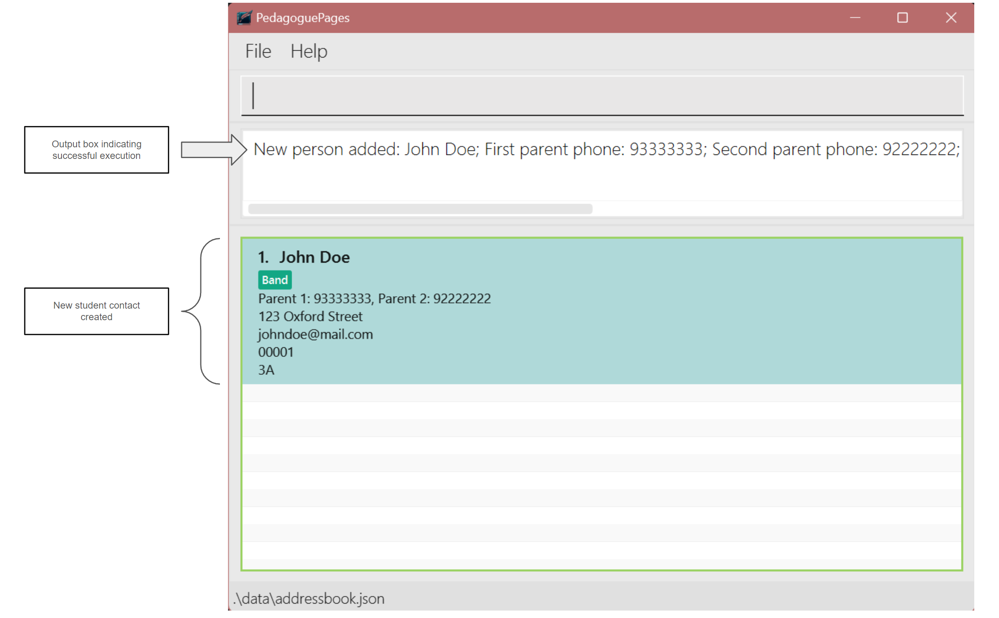
  

**:grey_exclamation: Additional information:** 
* Pedagogue Pages supports the addition of students with only `1` parent contact number. You can do so by only 
specifying `PARENT_PHONE_NUMBER_1`.   For example: `add n/John Doe p/93333333 e/johndoe@mail.com a/123 Oxford 
Street id/00001 class/3A t/Band`  
In such cases, the GUI of Pedagogue Pages will display 
`PARENT_PHONE_NUMBER_1` as the contact numbers of both `Parent 1` and `Parent 2`. So for the example above, both 
`Parent 1` and `Parent 2` of `John Doe` will have the contact number `93333333`.

### Displaying the entire student contact list: `list`

**Purpose**: Displays the entire student contact list for your viewing.

**Format**: `list`

**Example**: `list`

**Image of command**: The image below shows the sample command within the command box    

  
**Image of result**: The image below shows what the GUI of Pedagogue Pages should display after executing the sample
command   
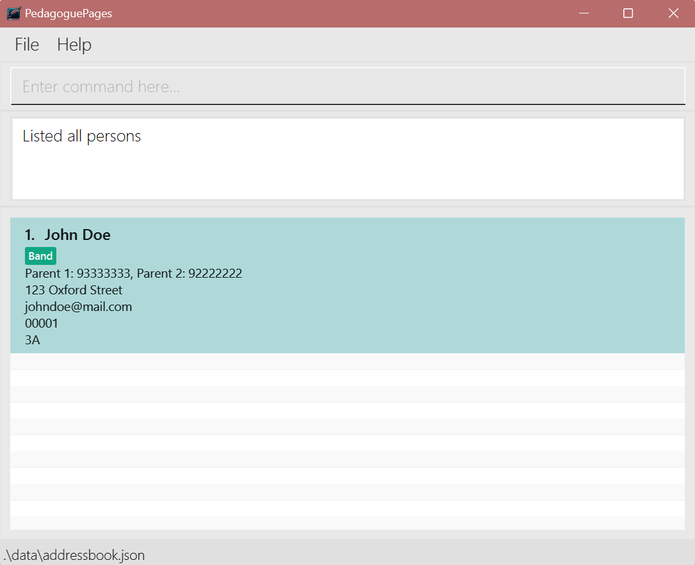
  

### Editing a student contact: `edit`

**Purpose**: Edits an existing student contact specified by his or her `student ID` in the student contact list.

**Format**: `edit STUDENT_ID [n/NAME] [p/PARENT_PHONE_NUMBER, WHICH_TO_EDIT] [e/EMAIL] [a/ADDRESS] [id/STUDENT ID]
[class/CLASS] [t/TAG]…​`

**Example**: `edit 00001 p/94444444, 1 a/345 Cambridge Street class/3B`  
This sample command changes the following parameters of the student with `student ID 00001`: **first** parent phone 
number (specified by the parameter`WHICH_TO_EDIT`) to `94444444`, address to `345 Cambridge Street` and form class 
to `3B`.

**Image of command**: The image below shows the sample command within the command box    
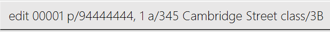
  
**Image of result**: The image below shows what the GUI of Pedagogue Pages should display after executing the sample
command   
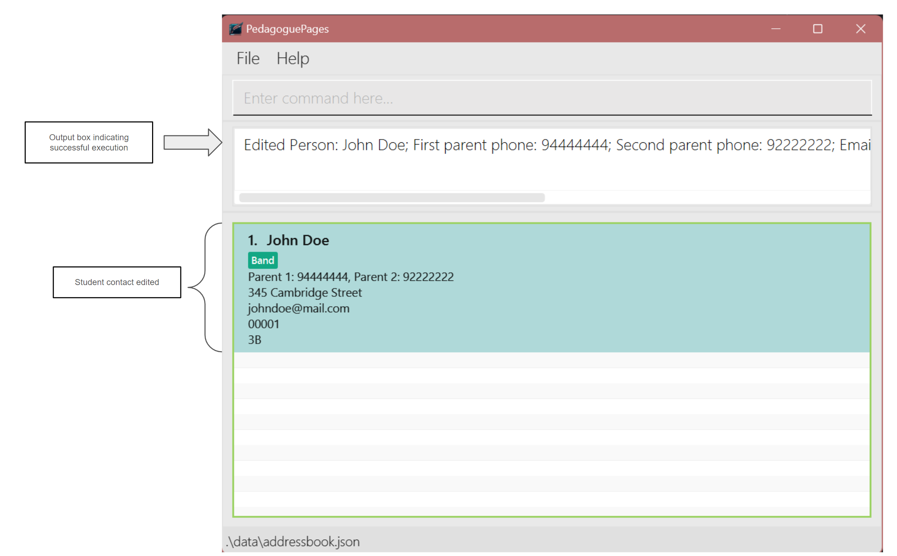
  

**:grey_exclamation: Additional information:** 
* At least one of the optional parameters must be provided.
* When editing tags, the adding of tags is not cumulative.   Example: If a student with `student ID 00001` has the 
  tags `Band` and `Tutoring Math`, and the command `edit 00001 t/Tutoring English` is executed, the tags `Band` and 
  `Tutoring Math` will be removed and the only tag the student will have after the command is `Tutoring English`.
* It is possible to remove all tags from a student by specifying no tag behind the prefix `t/`.   Example: `edit 
  00001 t/`.

### Deleting a student contact: `delete`

**Purpose**: Deletes a student contact specified by `student ID` from the student contact list you no longer wish to 
keep track of.

**Format**: `delete STUDENT_ID`

**Example**: `delete 00001`  
This sample command deletes the student contact with `student ID 00001`.

**Image of command**: The image below shows the sample command within the command box    

  
**Image of result**: The image below shows what the GUI of Pedagogue Pages should display after executing the sample
command   
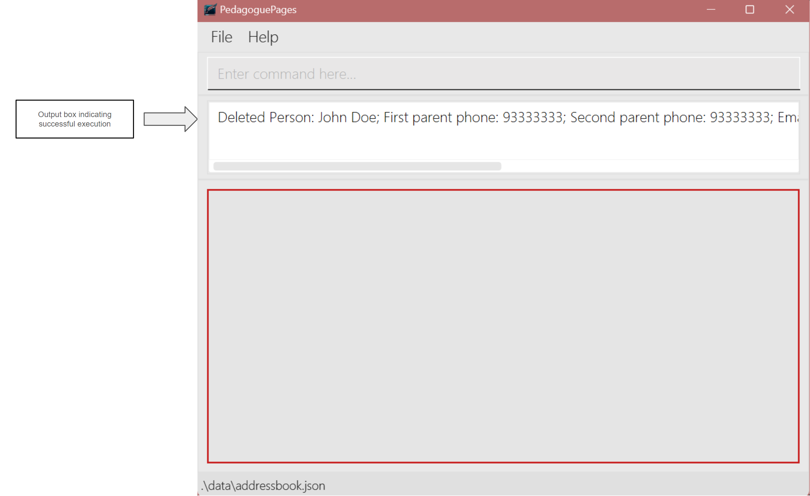
  

**:grey_exclamation: Additional information:** 
* You are encouraged to check the `student ID` carefully before executing this command.

### Deleting an entire student contact list: `clear`

**Purpose**: Deletes all student contacts in a student contact list you no longer wish to keep.

**Format**: `clear`

**Example**: `clear`

**Image of command**: The image below shows the sample command within the command box    
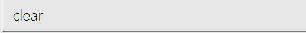
  
**Image of result**: The image below shows what the GUI of Pedagogue Pages should display after executing the sample
command   
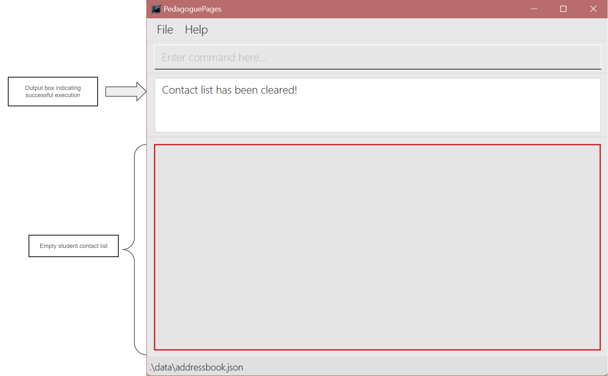
  

**:grey_exclamation: Additional information:** 
* Use this command extremely carefully. The `undo` command _**cannot**_ reverse the `clear` command. 

### Deleting a tag from all students in the student contact list: `deleteTag`

**Purpose**: Deletes the specified tag from **ALL** students from Pedagogue Pages

**Format**: `deleteTag TAGNAME`

**Example**: `deleteTag Band`  
This sample command deletes the Tag `Band` from all students in the student contact list.

**Image of student contact list before the command**: The image below shows the student contact list before the 
sample command was executed. 
   
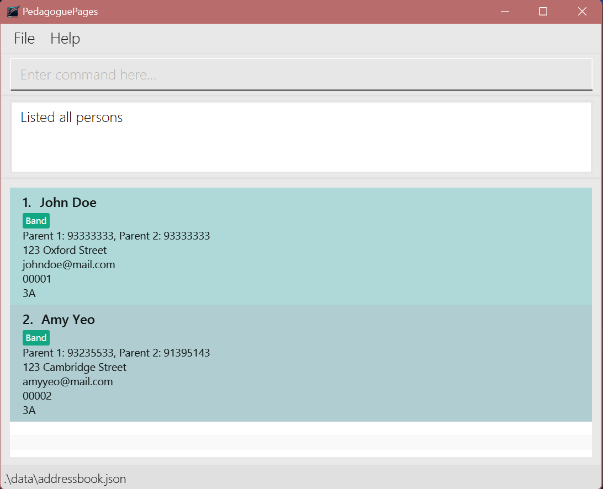
  
**Image of command**: The image below shows the sample command within the command box    
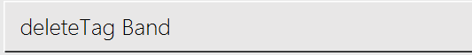
  
**Image of result**: The image below shows what the GUI of Pedagogue Pages should display after executing the sample
command   
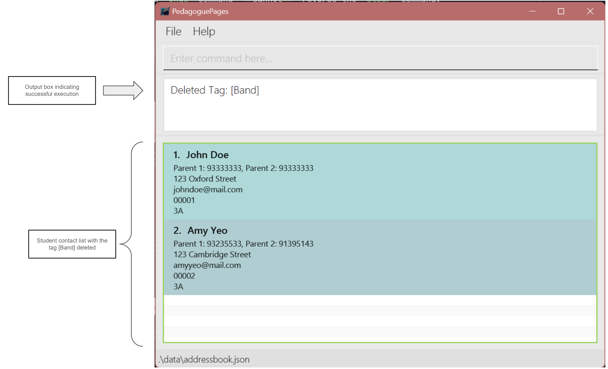
  

## Additional functionality: Find, sort, undo

### Locating a student contact in the student contact list: `find`

**Purpose**: Finds student contacts based on the keywords you provided.

**Format**: `find MODE KEYWORD [MORE_KEYWORDS]`

**:grey_exclamation: Explanation of the format:** 
* The `MODE` of the command decides which parameter to find student contacts with in the student contact list.
  * Mode = `name`: Find by `Name`
  * Mode = `id`: Find by `Student ID`
  * Mode = `class`: Find by `Form class`
  * Mode = `tag`: Find by `Tag` name

**Example**: `find name John`  
This sample command searches the student contact list for all students with `John` within their names and displays 
them in a fresh list.

**Image of student contact list before the command**: The image below shows the student contact list before the
sample command was executed.
   

  
**Image of command**: The image below shows the sample command within the command box    

  
**Image of result**: The image below shows what the GUI of Pedagogue Pages should display after executing the sample
command   
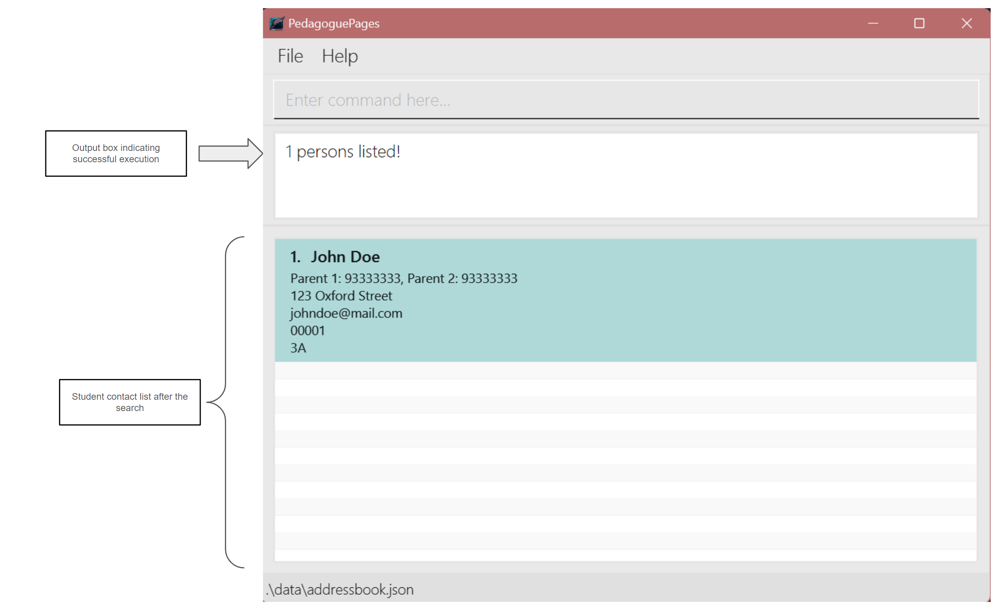
  

**:grey_exclamation: Additional information:** 
* The find command is case-insensitive. Example: `hans` will match `Hans`
* The order of the keywords does not matter. Example: `Hans Bo` will match `Bo Hans`
* Only full words will be matched Example: `Han` will not match `Hans`
* Students matching at least one keyword will be returned (i.e. `OR` search).
  Example: `Hans Bo` will return `Hans Gruber`, `Bo Yang`

### Sorting student contacts in the student contact list: `sort`

**Purpose**: Sorts the student contacts in the student contact list based on the `MODE` of the command you supply.

**Format**: `sort /MODE`

**:grey_exclamation: Explanation of the format:** 
* The `MODE` of the command decides which parameter to sort student contacts by.
    * Mode = `name`: Sort by `Name`
    * Mode = `id`: Sort by `Student ID`

**Example**: `sort /name`
**Image of student contact list before the command**: The image below shows the student contact list before the
sample command was executed.
   

  
**Image of command**: The image below shows the sample command within the command box    
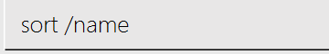
  
**Image of result**: The image below shows what the GUI of Pedagogue Pages should display after executing the sample
command   
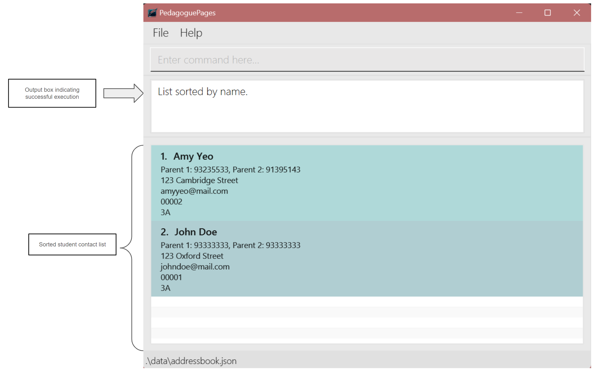
  

### Undoing an undesired command: `undo`

**Purpose**: Undoes a command you wish to reverse.

**Format**: `undo`

**Example**: `undo`  
This sample command undoes the last `add, edit` or `delete` command performed. 

**Image of student contact list before the command**: The image below shows the student contact list before the
sample command was executed.
   
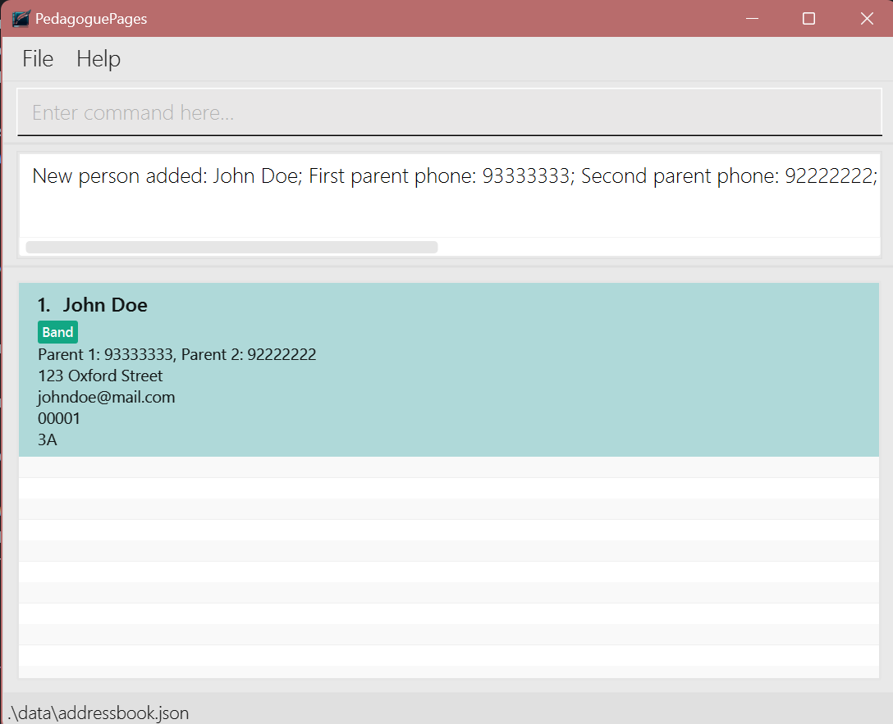
  
**Image of command**: The image below shows the sample command within the command box    

  
**Image of result**: The image below shows what the GUI of Pedagogue Pages should display after executing the sample
command   
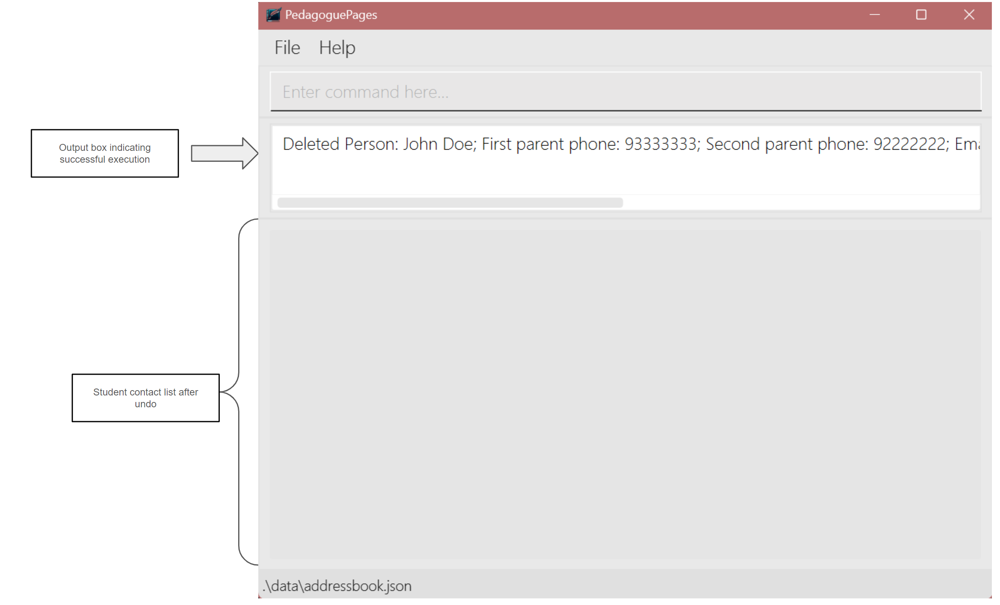
  

**:grey_exclamation: :warning: Additional information and potential issues:** 
* You can repeatedly give `undo` commands until there are no more `add, edit` or `delete` commands to `undo`. 
  However, do be careful when giving `undo` commands when you have performed some non-`add, edit, delete` commands 
  after the command you wish to `undo`, the results produced may be undesirable.

## File manipulation: cd, export, import, migrate

### Changing the source save file of the student contact list displayed: `cd`

**Purpose**: Changes the current student contact list to another student contact list which is stored as a `.json` file.

**Format**: `cd FILEPATH`

**Example** `cd data/pp1.json.`

**Image of student contact list before the command**: The image below shows the student contact list before the
sample command was executed.
   
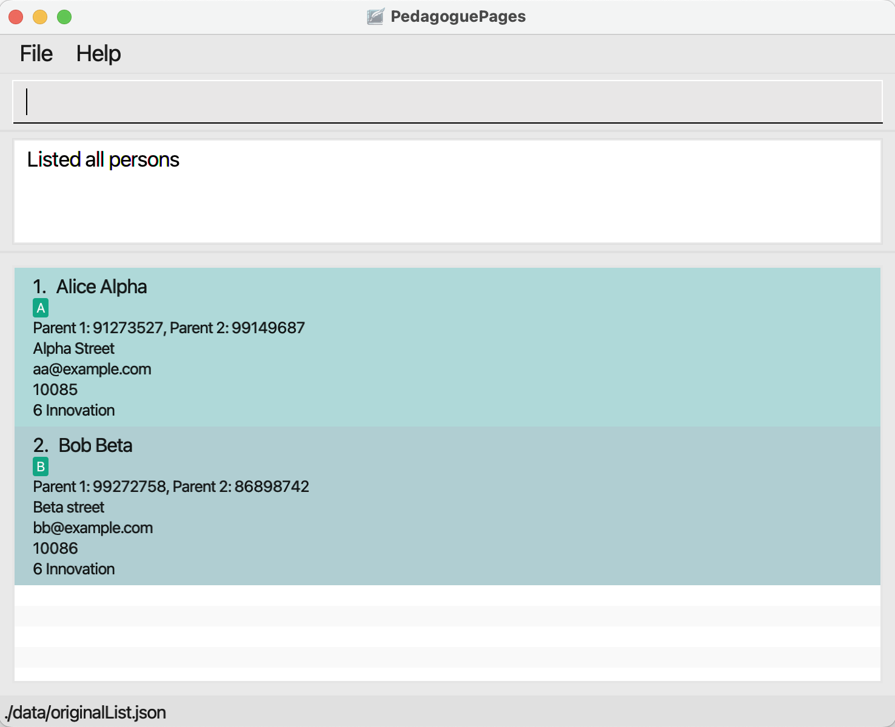
  
**Image of command**: The image below shows the sample command within the command box    
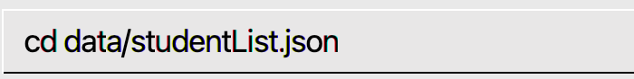
  
**Image of result**: The image below shows what the GUI of Pedagogue Pages should display after executing the sample
command   
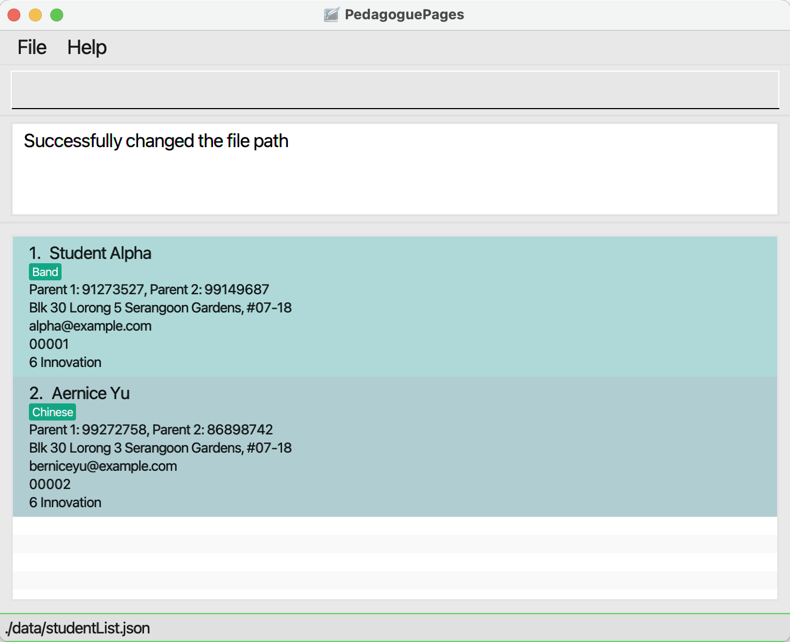
  

**:grey_exclamation: Additional information:** 
* The cd command only accepts the `FILEPATH` end with `.json`. Example: `data/studentsList.json` will be a valid `FILEPATH`.
* If there is no file under the provided `FILEPATH`, cd command will create one for you under the provided `FILEPATH`.

### Exporting a student contact list: `export`

**Purpose**: Exports the currently viewed student contact list as a CSV file to the `exports` folder, which you can 
then open with applications like Excel.

**Format**: `export FILENAME`

**Example**: `export Class 3C`  
This sample command exports the currently viewed student list as a CSV file named `Class 3C.csv`.

**Image of student contact list before the command**: The image below shows the student contact list before the
sample command was executed.
   
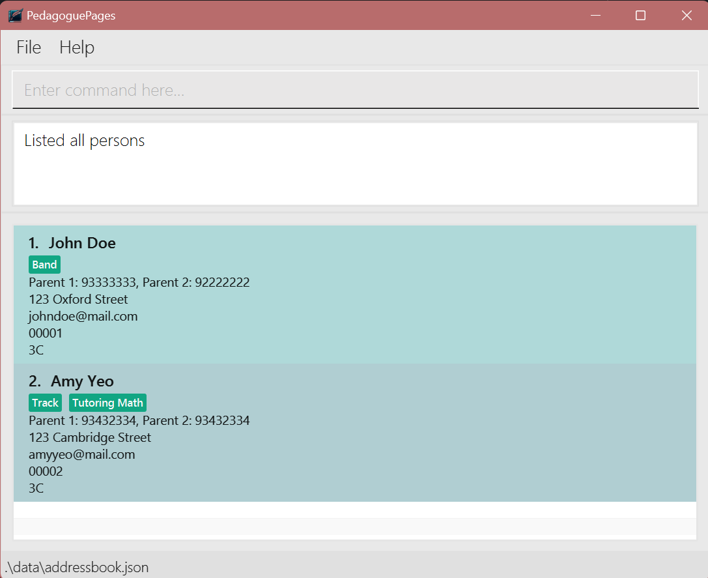
  
**Image of command**: The image below shows the sample command within the command box    

  
**Image of result**: The image below shows what the GUI of Pedagogue Pages should display after executing the sample
command   
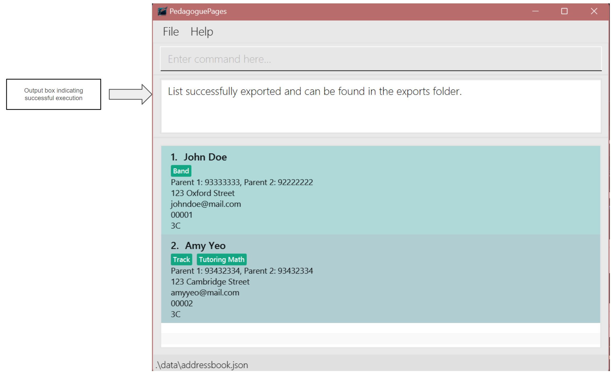
  
**Image of file system**: The image below shows what the exports folder should look like after executing the sample 
command   
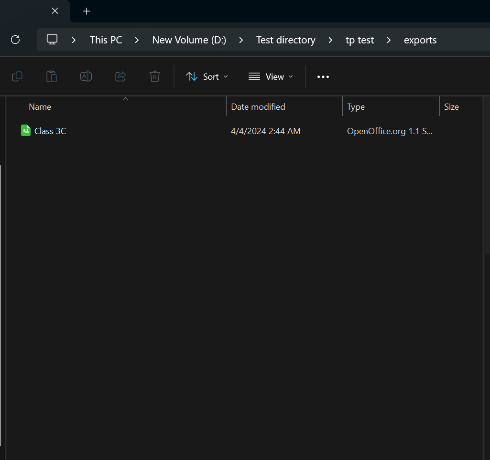
  
**Image of csv file**: The image below shows what the exported CSV file should look like when opened in an 
application similar to Excel   
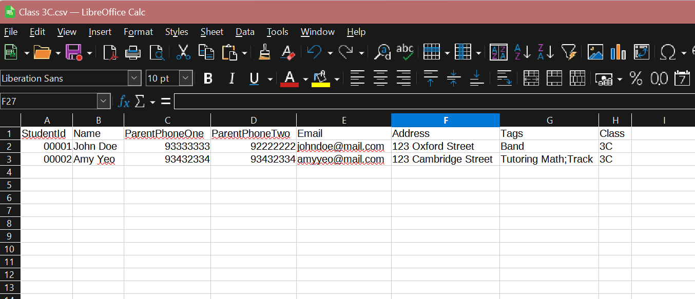
  

**:grey_exclamation: Additional information:** 
* To avoid overwriting of files, if the `FILENAME` you've provided already exists within the `exports` folder, 
  Pedagogue Pages will still export your current list, but with the name `export_{Date and Time}.csv`.

### Importing a student contact list: `import`

**Purpose**: Imports a student contact list stored in a CSV file within the `imports` folder into Pedagogue Pages, 
where you can run other commands on it.

**Format**: `import FILENAME`

**Example**: `import Class 3A`  
This sample command imports the student contact list within a file named `Class 3A.csv` into Pedagogue Pages. 

**:grey_exclamation: CSV format:** 
* For a successful import, the format of the student contact entries within the CSV file must strictly follow that 
  of the image below. Furthermore, all parameters must comply by constraints of Pedagogue Pages.
* There must be no duplicates in the `student ID` field within the CSV file. Else the import command will fail.

**Image of student contact list before the command**: The image below shows the student contact list in the CSV file 
before the sample command was executed.
   
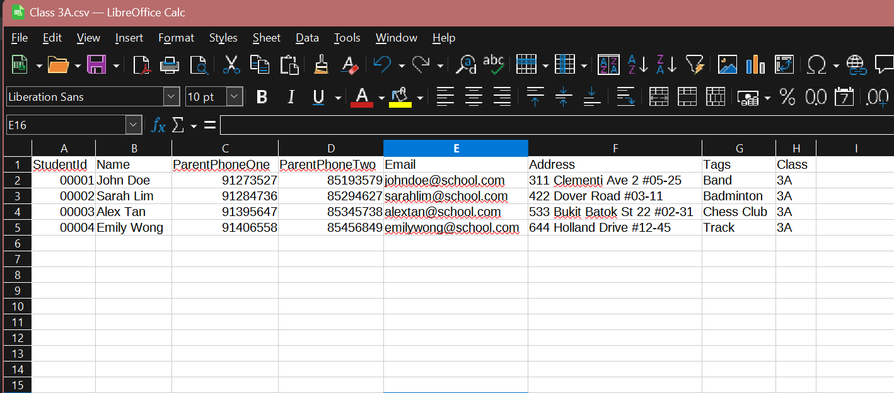
  
**Image of command**: The image below shows the sample command within the command box    

  
**Image of result**: The image below shows what the GUI of Pedagogue Pages should display after executing the sample
command   
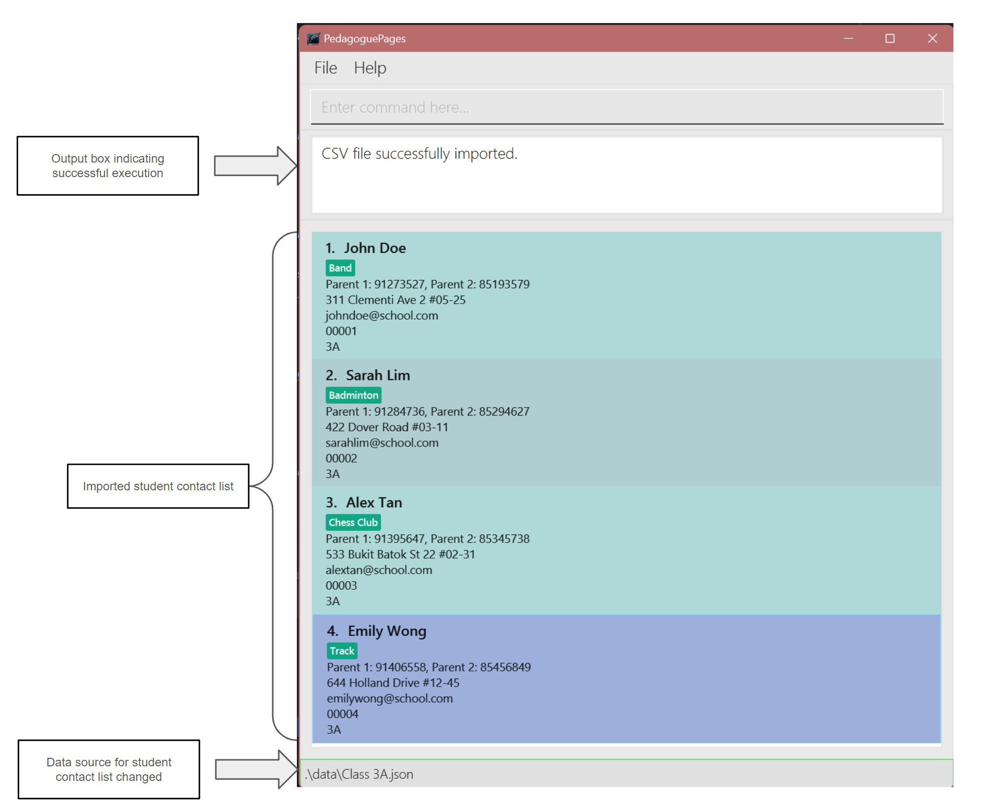
  

**:grey_exclamation: Additional information:** 
* After each successful import, a new JSON file containing the data from the imported CSV file is created in the 
  `data` folder. These `2` files will share the same name before the suffix.
* If the name of the CSV file you are about to import is the same as the name of a JSON file without the suffixes that 
  already exists in the `data` folder, the import will not be successful. Change the name of the CSV file before 
  attempting again.

### Merging student contact lists: `migrate`

**Purpose**: Merges the student contacts in a CSV file in the `imports` folder with your current student contact 
list open in Pedagogue Pages. 

**Format**: `migrate FILENAME`

**Example**: `migrate Class 3B`  
This sample command merges the student contact entries in a file named `Class 3B.csv` with the existing student 
contact list. 

**:grey_exclamation: CSV format:** 
* For a successful import, the format of the student contact entries within the CSV file must strictly follow that
  of the image below. Furthermore, all parameters must comply by constraints of Pedagogue Pages.
* There must be no duplicates in the `student ID` field, either internally within the CSV or in the resultant merged 
  student contact list, else the migrate command will fail.

**Image of student contact list before the command**: The image below shows the student contact list in the CSV file
before the sample command was executed.
   
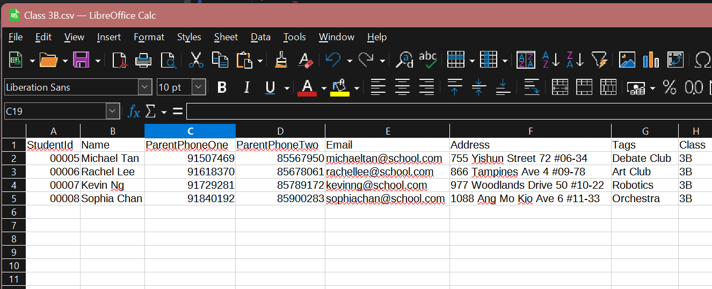
  
**Image of student contact list before the command**: The image below shows the currently open student contact list 
in Pedagogue Pages we want to merge the student contacts in the CSV file into with the sample command.
   
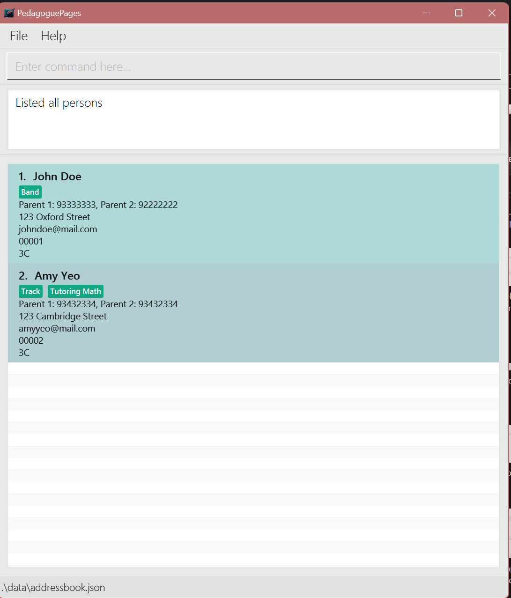
  
**Image of command**: The image below shows the sample command within the command box    
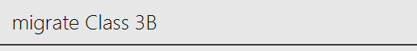
  
**Image of result**: The image below shows what the GUI of Pedagogue Pages should display after executing the sample
command   
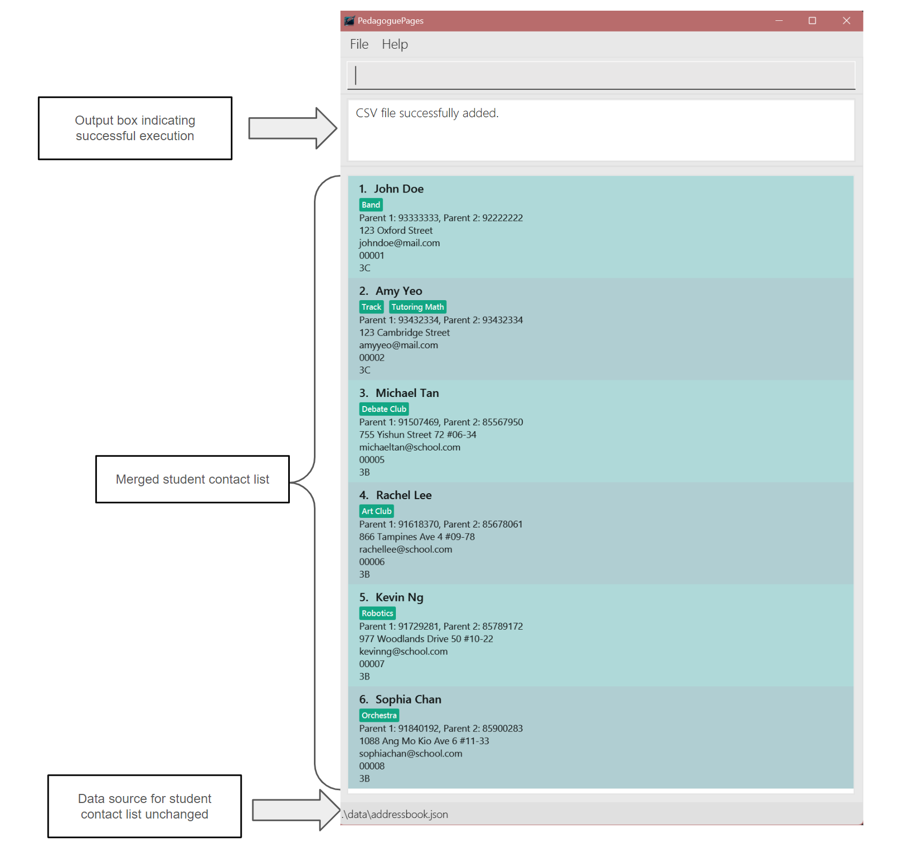
  

## Miscellaneous commands: help, theme, exit

### Accessing the user guide: `help`

**Purpose**: Provides a hyperlink through which you can access this user guide.

**Format**: `help`

**Example**: `help`

**Image of command**: The image below shows the sample command within the command box    
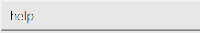
  
**Image of result**: The image below shows what the GUI of Pedagogue Pages should display after executing the sample
command   
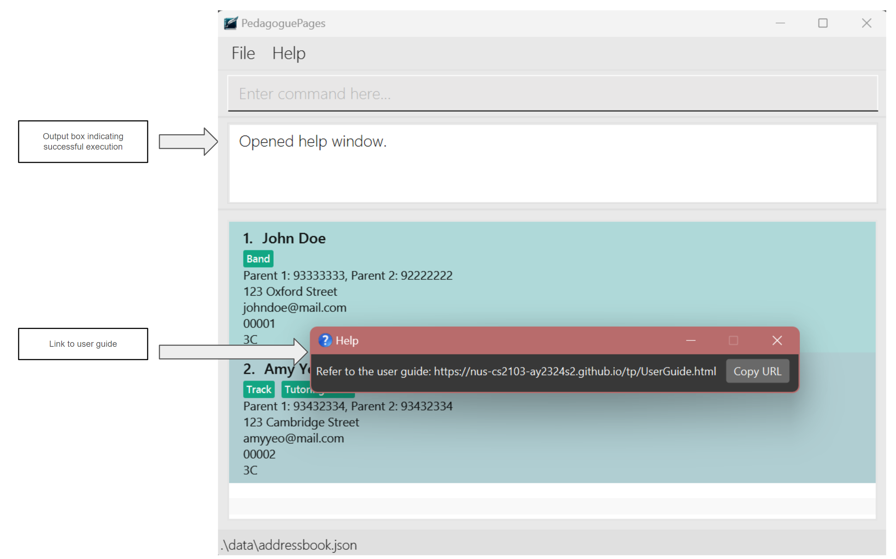
  

### Changing the visual theme: `theme`

**Purpose**: Changes the visual theme of Pedagogue Pages to whichever one you prefer.

**Format**: `theme`

**Example**: `theme`

**Image of command**: The image below shows the sample command within the command box    

  
**Image of light theme**: This image below shows the light theme of Pedagogue Pages   
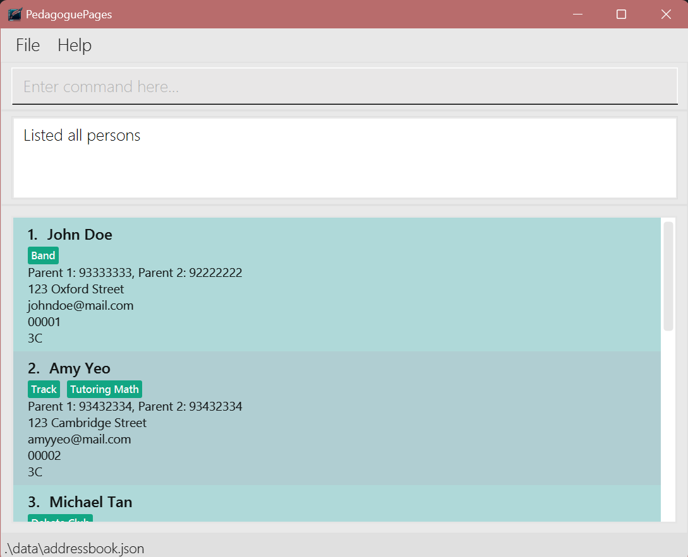
  
**Image of dark theme**: This image below shows the dark theme of Pedagogue Pages   
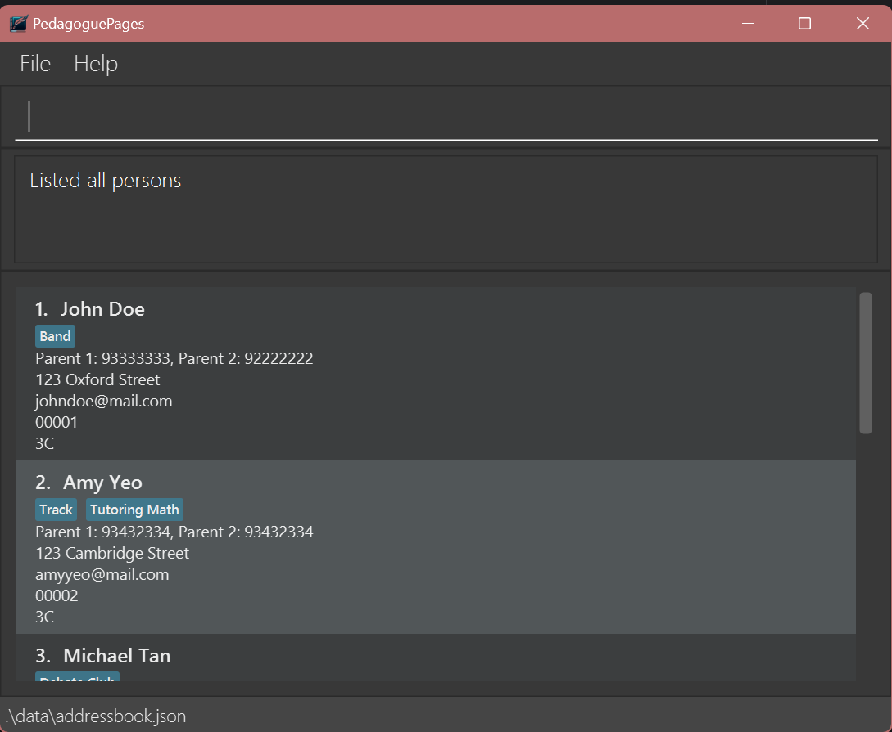
  

### Exiting Pedagogue Pages: `exit`

**Purpose**: Exits the application when you are done with the day's work.

**Format**: `exit`

**Example**: `exit`

**Image of command**: The image below shows the sample command within the command box    

  

--------------------------------------------------------------------------------------------------------------------

## Troubleshooting and Known Issues

1. **When using multiple screens**, if you move the application to a secondary screen, and later switch to using only the primary screen, the GUI will open off-screen. The remedy is to delete the `preferences.json` file created by the application before running the application again.

--------------------------------------------------------------------------------------------------------------------

## FAQ

**Q**: How do I transfer my data to another Computer? 
**A**: Install the app in the other computer and overwrite the empty data file it creates with the file that contains the data of your previous Pedagogue Pages home folder.

--------------------------------------------------------------------------------------------------------------------

## Input restrictions

| Field                    | Restrictions                                                                                                                                                                |
|--------------------------|-----------------------------------------------------------------------------------------------------------------------------------------------------------------------------|
| `NAME`                   | Type: Alphanumeric String   Other restrictions: -                                                                                                                        |
| `PARENT_PHONE_NUMBER`    | Type: 8 digit positive integer   Other restrictions: Must not begin with `0`.                                                                                            |
| `EMAIL`                  | Type: Alphanumeric username followed by an "@", then an alphanumeric domain                                                                                                 |
| `ADDRESS`                | Type: Alphanumeric String   Other restrictions: -                                                                                                                        |
| `STUDENT_ID`             | Type: 5 digit positive integer   Other restrictions: -                                                                                                                   |
| `TAG`                    | Type: Alphanumeric String   Other restrictions: Maximum length of `2` words                                                                                              |
| `WHICH_NUMBER_TO_EDIT`   | Type: Can only be `1` or `2`                                                                                                                                                |
| `MODE` (For find)        | Type: Can only be `name`, `id`, `tag` or `class`                                                                                                                            |
| `MODE` (For sort)        | Type: Can only be `name` or `id`                                                                                                                                            |
| `PATH` (For cd)          | Type: Can only be of the format `data/{FILENAME}`                                                                                                                           |
| `FILENAME` (For export)  | Type: Alphanumeric String   Other restrictions: -                                                                                                                        |
| `FILENAME` (For import)  | Type: Alphanumeric String   Other restrictions: CSV file with `FILENAME` must exist in `imports` folder,   JSON file with `FILENAME` must not exist in `data` folder. |
| `FILENAME` (For migrate) | Type: Alphanumeric String   Other restrictions: CSV file with `FILENAME` must exist in `imports` folder.                                                                 |

--------------------------------------------------------------------------------------------------------------------
